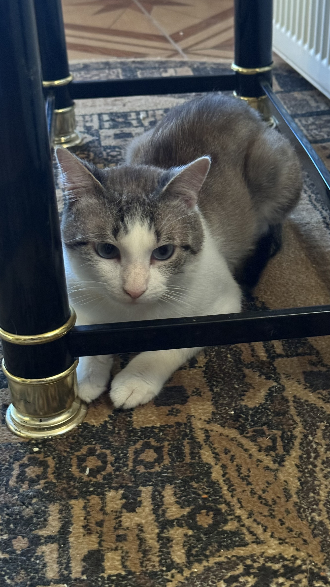
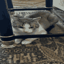

Version 1.1o of readme.md for MakePictureLowRes.py

This is the readme.md for MakePictureLowRes.py made by RubenAzaHeker aka RubenGT

This is an open source code, so feel free to edit it however you want. But remember, if you once edit it the edited code is in your hands :)

English is not my first language so excuse me for my bad grammar, thanks.

Download MakePictureLowRes.py first then read this, or you can just read this without downloading the code

Things you need to know before downloading: 

- This program "Degrades" or "Compresses" the picture you chose while running the code
- You need Python and Pillow extension installed for the code to work, otherwise there will be errors and the code wont run
- You dont need an editor to edit the colors and resolutions now! (more on that on line 32)

Things you need to know about the program: You need to have Python installed for it to work of course
BUT! you need to have Pillow installed too ("pip install Pillow" in a terminal)

My experience with this Python and Pillow thing on windows, uh, somewhy the Windows Terminal or CMD dosent recognize that Python is installed when you download it 
from Pythons Website so you gotta install Python from the Microsoft store too because I dont really know if there is a way to point the CMD the 
Pythons file path so yeah.

About the code:

- !!! To locate a directory please use "\" not "/" its not the same !!! (Example: C:\Users\User\Desktop\Pictures\picture.png). file extension needed. !!!

- Supports PNG, JPG, JPEG file formats as input, Others may work but its not guaranteed that they will
- Supports PNG as output, only PNG.
- Since Update 1.2, you dont need an editor to edit the resolution and colors. But you'll need it if you want to go above 512 pixels and 256 colors, or you just want to edit the code
- When Editing the file (which you dont need to now), dont change anything exept "new_width1", "new_height1" and "num_colors1". Otherwise you might do
something with the code that will make it malfunction and not work :(
- Make Minecraft texturepacks with this if you want, but if you do share it with me, ill try it! discord: rubenazaheker
- This version actually has a couple more different versions. One even with a GUI, but those are bad and just for testing purposes only. In the near future
I might release a version with GUI or a version that lets you edit the resolution and colors when starting the code so you dont need to edit the code in an editor. "o" stands 
for Official, all the other versions which are not release to the public are "u" which stands for Unofficial of course. The actual 1.0 is unavailable for download.

- Example image of my cat Milo for illustration:

Milo (my cat) before downscaling:

Milo after downscaling. 128 by 128 pixels and 16 colors.:

I suppose that this is it for readme.md

Checkout my website at http://www.rubengt.site !

Version of readme.md: 1.2o    Just did some editing to match up with the code.
Version of the actual code: 1.2o   Major-ish Update.

Code Changelog:

- Now you dont need an editor to edit values.
- The code is now 123 lines long!
- I learned more python :)...